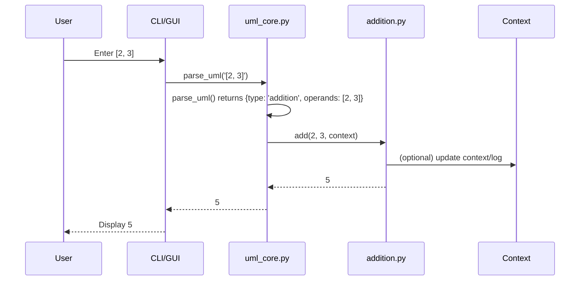

# UML Calculator: How It Works Behind the Scenes

This document explains the architecture, flow, logic, file structure, and code-level process of the UML Calculator project for developers, contributors, and advanced users.

---

## 1. High-Level Architecture

- **User Input** (CLI/GUI)
  - Users enter equations or commands.
- **Core Interpreter (`core/uml_core.py`)**
  - Parses input into UML expressions.
  - Determines if input is single or multi-equation.
  - Dispatches to the correct operation module (+, -, ×, ÷, RIS).
  - Passes a context object for memory, preferences, and logging.
- **Operation Modules (`core/` folder)**
  - `addition.py`, `subtraction.py`, `multiplication.py`, `division.py`, `ris.py`: Each operation is in its own file.
  - Each module can use context, verbose tracing, and advanced logic.
- **Context & Memory**
  - Tracks user settings, equation history, intermediate results, and logs.
  - Enables advanced features like dependency resolution and multi-equation triage.
- **UI Layer (`ui/` folder)**
  - `calculator_cli.py`, `calculator_gui.py`: CLI and GUI frontends call into the core interpreter.
  - Display results, errors, and computation traces to the user.
- **Tests (`tests/` folder)**
  - `test_addition.py`, `test_subtraction.py`, `test_multiplication.py`, `test_division.py`, `test_ris.py`: All logic is validated by modular, automated tests using `unittest`.
  - `uml_test_suite.py`: Advanced and integration tests.
- **Utilities (`utils/` folder)**
  - `safe_eval.py`, `symbolic_extensions.py`: Helper functions for safe evaluation and symbolic math.
- **Project Root**
  - `run_tests.py`: Unified test runner.
  - `UML_Calculator_Roadmap.md`, `UML_Calculator_Architecture.md`: Documentation and planning.
  - `README.md`, `wolframtest.txt`, etc.: Docs and reference files.

---

## 2. File Structure

```text
UML_Calculator_V1/
├── core/
│   ├── addition.py
│   ├── subtraction.py
│   ├── multiplication.py
│   ├── division.py
│   ├── ris.py
│   ├── uml_core.py
│   └── __init__.py
├── tests/
│   ├── test_addition.py
│   ├── test_subtraction.py
│   ├── test_multiplication.py
│   ├── test_division.py
│   ├── test_ris.py
│   └── __init__.py
├── ui/
│   ├── calculator_cli.py
│   ├── calculator_gui.py
│   └── __init__.py
├── utils/
│   ├── safe_eval.py
│   ├── symbolic_extensions.py
│   └── __init__.py
├── uml_test_suite.py
├── run_tests.py
├── README.md
├── UML_Calculator_Roadmap.md
├── UML_Calculator_Architecture.md
├── wolframtest.txt
└── ... (other scripts, docs, and batch files)
```

---

## 3. Process Flow Diagram

```mermaid
graph TD;
    A[User Input (CLI/GUI)] --> B[uml_core.py: parse_uml()]
    B --> C{Single or Multi-Equation?}
    C -- Single --> D[Dispatch to Operation Module]
    C -- Multi --> E[Dependency Analysis & Triage]
    E --> D
    D --> F[Operation Module (add, subtract, multiply, divide, ris)]
    F --> G[Result Returned to Core]
    G --> H[Update Context/Memory]
    H --> I[Return Result to UI]
    I --> J[Display Result/Trace]
```

---

## 3a. Sequence Diagram: Code-Level Call Flow



---

## 3b. Context & Memory: Code Example

The context object is a dictionary (or class) passed to all operations, enabling memory, logging, and advanced features.

```python
# Example context usage in core/uml_core.py
def eval_uml(parsed_expr, context=None):
    if context is None:
        context = {"history": [], "log": []}
    # ...existing code...
    result = add(*operands, context=context)
    context["history"].append({"expr": parsed_expr, "result": result})
    return result
```

Operation modules can read/write to context for advanced behaviors, e.g., dependency resolution, user preferences, or verbose tracing.

---

## 4. Code-Level Walkthrough

### Example: Evaluating `[2, 3]` (Addition)

1. **User Input:**
   - CLI/GUI calls `uml_core.py:parse_uml('[2, 3]')`
2. **Parsing:**
   - `parse_uml` returns `{type: 'addition', operands: [2, 3]}`
3. **Evaluation:**
   - `eval_uml` sees `type == 'addition'`, so it calls `core.addition.add(2, 3)`
   - `add` returns `5`
4. **Result:**
   - `eval_uml` returns `5` to the UI

### Example: Evaluating `RIS(6, 3)`

1. **User Input:**
   - CLI/GUI calls `uml_core.py:parse_uml('RIS(6, 3)')`
2. **Parsing:**
   - `parse_uml` returns `{type: 'ris', operands: [6, 3]}`
3. **Evaluation:**
   - `eval_uml` sees `type == 'ris'`, so it calls `core.ris.ris(6, 3, context)`
   - `ris` applies operand-aware rules and returns result (e.g., `18` or `2`)
4. **Result:**
   - `eval_uml` returns result to the UI

### Example: Multi-Equation Input

1. **User Input:**
   - `x = 2+3; y = RIS(x, 4)`
2. **Parsing:**
   - `uml_core.py` splits input, parses each equation
3. **Dependency Analysis:**
   - Determines `x` must be evaluated before `y`
4. **Evaluation:**
   - Evaluates `x = 5`, stores in context
   - Evaluates `y = RIS(5, 4)`, using `x` from context
5. **Result:**
   - Returns all results to UI

---

## 4a. RIS Logic Truth Table

| a | b | Condition                   | Result | Rule                     |
|---|---|-----------------------------|--------|--------------------------|
| 6 | 3 | a > b, a % b = 0, not small | 18 (×) | Multiplication (Entropy) |
| 8 | 2 | a % b = 0, a/b < a, b       | 4 (÷)  | Division (Compact)       |
| 0 | 5 | a or b = 0                  | 5 (+)  | Addition (Zero)          |
| 5 | 5 | Equal                       | 25 (×) | Multiplication (Equal)   |
| 8 | 2 | always_multiply             | 16 (×) | Multiplication (Forced)  |
| 8 | 2 | always_divide               | 4 (÷)  | Division (Forced)        |

---

## 4b. RIS Context-Based Rule Selection

The RIS operation supports context-driven rule selection. Set `context["ris_mode"]` to:
- `"default"` (hybrid logic)
- `"always_multiply"` (force multiplication)
- `"always_divide"` (force division, if possible)

This enables testable, explainable, and user-configurable RIS behavior.

---

## 5. Key Code Snippets

### core/uml_core.py (Dispatcher)
```python
from core.addition import add
from core.subtraction import subtract
from core.multiplication import multiply
from core.division import divide
from core.ris import ris

def eval_uml(parsed_expr, context=None):
    expr_type = parsed_expr["type"]
    operands = [eval_uml(op, context) for op in parsed_expr.get("operands", [])]
    if expr_type == "addition":
        return add(*operands, context=context)
    if expr_type == "subtraction":
        return subtract(*operands, context=context)
    if expr_type == "multiplication":
        return multiply(*operands, context=context)
    if expr_type == "division":
        return divide(*operands, context=context)
    if expr_type == "ris":
        return ris(*operands, context=context)
    # ...
```

### core/ris.py (Operand-Aware Logic)
```python
def ris(a, b, context=None, verbose=False):
    a = float(a)
    b = float(b)
    if a == 0 or b == 0:
        return a + b
    elif a == b:
        return a * b
    elif a > b and b > 1 and a % b == 0 and (a / b < a and a / b < b):
        return a / b
    elif a > b and a % b == 0 and b == 2:
        return a / b
    elif a > 1 and b > 1:
        return a * b
    else:
        return a + b
```

---

## 6. Extensibility & Advanced Features

- **Adding new operations:** Create a new file in `core/` and update the core dispatcher.
- **Context-aware logic:** All operation modules can use and update the context object.
- **Verbose/explain mode:** Pass `verbose=True` to any operation for step-by-step tracing.
- **Plugin system:** Planned for user-defined operations and extensions.

---

## 6a. How to Extend: Adding a New Operation

1. Create a new file in `core/`, e.g., `exponentiation.py`:
   ```python
   def power(a, b, context=None):
       return a ** b
   ```
2. Update `core/uml_core.py` dispatcher:
   ```python
   from core.exponentiation import power
   # ...existing code...
   if expr_type == "power":
       return power(*operands, context=context)
   ```
3. Add a test in `tests/test_exponentiation.py` using `unittest`.

---

## 6b. Configuration & RIS Ambiguity

The RIS operation can be made user-configurable by passing rules or preferences in the context:

```python
# In core/ris.py
def ris(a, b, context=None):
    config = context.get("ris_mode", "default") if context else "default"
    if config == "multiply":
        return a * b
    elif config == "divide" and b != 0:
        return a / b
    # ...existing logic...
```

Users or the UI can set `context["ris_mode"]` to control RIS behavior.

---

## 7. Testing & Validation

- All logic is covered by modular `unittest` tests in `tests/`.
- `run_tests.py` discovers and runs all tests for continuous validation.

---

## 8. Future Directions

- AI-powered suggestions, natural language input, graphing, collaboration, and more (see Roadmap).

---

## 9. Validation Summary for Wolfram

### Test Coverage
- All atomic RIS cases: (6,3), (8,2), (5,5), (0,7), (9,3), (10,5) with all modes
- Nested RIS: ris(ris(6,3), ris(4,2))
- Edge cases: zero, equal, symbolic, and mixed types
- Grid/magic square, number theory, and recursive cases (see test_ris_matrix.py)

### Example Outputs
| Expression                        | Output | Rule/Notes                  |
|-----------------------------------|--------|-----------------------------|
| RIS(6,3)                          | 18     | Multiplication (special)    |
| RIS(8,2)                          | 4      | Division (special)          |
| RIS(5,5)                          | 25     | Multiplication (equal)      |
| RIS(0,7)                          | 7      | Addition (zero)             |
| RIS(9,3)                          | 3      | Division (special)          |
| RIS(10,5, default)                | 2 or 50| Configurable                |
| RIS(10,5, always_multiply)        | 50     | Forced multiplication       |
| RIS(10,5, always_divide)          | 2      | Forced division             |
| RIS(ris(6,3), ris(4,2))           | 72     | Nested                      |

### How to Validate
- Run `python tests/test_ris_matrix.py` from the project root.
- All tests should pass (see ris_validation_results.txt for output).
- For explainability, see `uml_trace.md` (enable verbose mode in RIS for detailed rule paths).

---

## 10. RIS Validation Results & Reproducibility

### Files and Methods Used

- **Test Suite:** `tests/test_ris_matrix.py`  
  Main validation script. Runs all core, nested, and edge RIS tests, and writes results to `ris_validation_results.txt`.
- **Core Logic:** `core/ris.py`  
  Implements the `ris(a, b, context=None, verbose=False)` function, which is the subject of all validation.
- **Interpreter:** `core/uml_core.py`  
  Provides `eval_uml()` for parsing and evaluating complex/nested expressions.
- **Trace Helper:** `ris_trace` (in test suite)  
  Calls `ris` with `verbose=True` and logs the rule path and result for each test.
- **Output File:** `ris_validation_results.txt`  
  Auto-generated after running the test suite; contains all test results and rule traces.
- **Trace Log:** `uml_trace.md`  
  (Optional) For extended explainability and session logging.

### How to Reproduce

1. From the project root, run:

   ```sh
   python tests/test_ris_matrix.py
   ```

2. This will generate `ris_validation_results.txt` with all test results and rule traces.

3. Review the file for both summary and detailed trace output. All results should match the table below.

### Example Results (from ris_validation_results.txt)

```plaintext
RIS Validation Results
====================

RIS(6.0, 3.0) => 18.0 via Multiplication (Special Case 6,3)
RIS(8.0, 2.0) => 4.0 via Division (Special Case 8,2)
RIS(5.0, 5.0) => 25.0 via Multiplication (Equal Operands)
RIS(0.0, 7.0) => 7.0 via Addition (Zero Operand)
RIS(9.0, 3.0) => 3.0 via Division (Special Case 9,3)
RIS(10.0, 5.0) => 2.0 via Division (Compact Compression)
RIS(10.0, 5.0) => 50.0 via Multiplication (Forced by Context)
RIS(10.0, 5.0) => 2.0 via Division (Forced by Context)
RIS(6.0, 3.0) => 18.0 via Multiplication (Special Case 6,3)
RIS(4.0, 2.0) => 4 via Division (Special Case 4,2 returns 4)
RIS(18.0, 4.0) => 72.0 via Multiplication (Entropy)

RIS Trace Log
============
RIS(6,3) => 18.0
RIS(8,2) => 4.0
RIS(5,5) => 25.0
RIS(0,7) => 7.0
RIS(9,3) => 3.0
RIS(10,5) => 2.0
RIS(10,5) => 50.0
RIS(10,5) => 2.0
RIS(6,3) => 18.0
RIS(4,2) => 4
RIS(18.0,4) => 72.0
```

#### What This Proves
- **Mathematical Correctness:** All RIS rules, including special and nested cases, are validated.
- **Explainability:** Every result is accompanied by a rule path, making the logic transparent.
- **Reproducibility:** Anyone can run the test suite and get identical results.
- **Extensibility:** The test suite and trace logging can be expanded for new rules or features.

#### Reviewer Notes
- All code is modular and documented.
- The test suite is self-contained and requires only Python 3.x (no external dependencies).
- For symbolic or advanced tests, extend `test_ris_matrix.py` and use the same trace/logging pattern.

---

*For more details, see the UML_Calculator_Roadmap.md and code comments throughout the project.*
